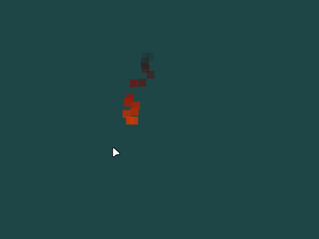

# SDL_fire
## Fire effect written in C using the SDL2 library.
The goal of the project is to provide a simple and aesthetically pleasing fire effect 
to be used in a pixel-art setting.
## Demo

## Prerequisites
- SDL2
- cmake (for building the library)
- [carena](https://github.com/broskobandi/carena.git)
- [cvec](https://github.com/broskobandi/cvec.git)
- [ctest](https://github.com/broskobandi/ctest.git) (for running the tests)
## Usage
```c
#include <assert.h>
#include <time.h>
#include <stdlib.h>
/* Include the library. */
#include <SDL_fire.h>

int main(void) {
	/* Set up the SDL session. */
	SDL_Init(SDL_INIT_EVERYTHING);
	SDL_Window *win = SDL_CreateWindow("test", 0, 0, 800, 600, SDL_WINDOW_SHOWN);
	SDL_Renderer *ren = SDL_CreateRenderer(win, -1, SDL_RENDERER_PRESENTVSYNC);
	SDL_Event event;
	const Uint8* keystate = SDL_GetKeyboardState(NULL);
	int is_running = 1;
	SDL_Point mouse_pos;
	SDL_SetRenderDrawBlendMode(ren, SDL_BLENDMODE_BLEND);

	/* Create the SDL_Fire object. */
	SDL_FRect base = {0, 0, 16.0f, 16.0f};
	SDL_Color col = {255, 100, 0, 255};
	Uint32 ticks_per_change = 10;
	float speed = 6.5f;
	Uint8 num_particles = 25;
	SDL_Fire *fire = SDL_CreateFire(base, col, ticks_per_change, speed, num_particles);
	assert(fire);

	/* Generate random seed. */
	srand((unsigned int)time(NULL));

	/* Set up the game loop. */
	while (is_running) {
		while (SDL_PollEvent(&event)) {}
		if (keystate[SDL_SCANCODE_Q]) is_running = 0;
		SDL_SetRenderDrawColor(ren, 30, 70, 70, 255);
		SDL_RenderClear(ren);

		SDL_GetMouseState(&mouse_pos.x, &mouse_pos.y);
		SDL_FPoint fmouse_pos;
		fmouse_pos.x = (float)mouse_pos.x;
		fmouse_pos.y = (float)mouse_pos.y;

		/* Update the fire position (we're using the mouse 
		 * position in this example).
		 * Generate a random direction for a newly emitted particle: */
		SDL_FireEmission emission = (SDL_FireEmission)rand() % SDL_FIRE_EMISSION_COUNT;
		assert(!SDL_UpdateFire(fire, fmouse_pos, SDL_GetTicks(), emission));

		/* Draw the SDL_Fire object. */
		assert(!SDL_DrawFire(fire, ren));

		SDL_RenderPresent(ren);
	}

	/* Destroy the fire object. */
	SDL_DestroyFire(fire);

	/* Clean up the SDL session. */
	SDL_DestroyRenderer(ren);
	SDL_DestroyWindow(win);
	SDL_Quit();

	return 0;
}
```
## Installation
```bash
git clone https://github.com/broskobandi/SDL_fire.git &&
cd SDL_fire &&
mkdir build &&
cd build &&
cmake .. &&
make &&
sudo make install
```
## Testing
```bash
cd SDL_fire/build &&
make test &&
./test
```
